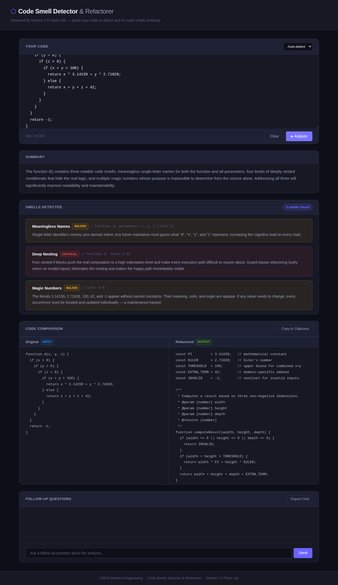

# Code Smells Detector & Refactorer

## Overview
A single-page web app that detects code smells and produces a refactored version using the Google Gemini API. Paste code, click Analyze, and get a severity-ranked smell report with side-by-side original vs. refactored code and a follow-up chat panel. Runs entirely on localhost — no backend, no build step.

## Installation

1. **Clone the repo**
   ```bash
   git clone https://github.com/ronnrr/Software-proj.git
   cd Software-proj
   ```

2. **Install dependencies** (Playwright + serve — only needed for running tests)
   ```bash
   npm install
   ```

3. **Add your Gemini API key**
   ```bash
   cp config.example.json config.json
   # Open config.json and replace PASTE_YOUR_GEMINI_API_KEY_HERE with your key
   ```
   Get a free key at [aistudio.google.com](https://aistudio.google.com).

4. **Start the server**
   ```bash
   npx serve . -l 3000
   # or: python -m http.server 3000   (no npm required)
   ```

5. **Open the app**
   ```
   http://localhost:3000/src/
   ```
   > The trailing slash on `/src/` is required — it keeps ES module paths resolving correctly.

## Usage

Paste code into the editor, optionally pick a language, then click **Analyze**.

**Sample input:**
```python
def d(x, y, z):
    if x > 0:
        if y > 0:
            if z > 0:
                return x * 3.14159 + y * 2.71828 + 42
    return -1
```

**Before analysis:**


**After analysis — smell cards, severity badges, refactored code:**


---

## Project Phases

### Phase 1 — Requirements Engineering
Defined 24 acceptance criteria across 6 functional requirement groups (code input, Gemini integration, smell report, refactored code, chat, state management) plus a formal Gemini prompt contract.
- [Phase 1 Chat](chats/phase1-requirements.txt) — AI-assisted session that produced `docs/requirements.md`; covers prompt contract design, JSON output schema, and why multi-turn chat adds grading value.

### Phase 2 — Architecture
Designed a frontend-only SPA with 5 single-responsibility JS modules; documented all technology, LLM integration, and team responsibility decisions.
- [Phase 2 Chat](chats/phase2-architecture.txt) — AI-assisted session that produced `docs/architecture.md`; covers the `x-goog-api-key` header strategy, why no backend is needed, and the `response_mime_type: application/json` forcing trick.

### Phase 3 — Coding & Testing

#### Key Files
| File | Description |
|------|-------------|
| [src/index.html](src/index.html) | Single HTML page; all panels, ARIA labels, and module `<script>` tag |
| [src/js/app.js](src/js/app.js) | Entry point; reads config, binds all event listeners, orchestrates modules |
| [src/js/api.js](src/js/api.js) | Gemini API wrapper; `loadConfig()`, `analyzeCode()`, `sendFollowUp()`; timeout and error handling |
| [src/js/prompt.js](src/js/prompt.js) | Single source of truth for both prompt templates (analysis + follow-up) |
| [src/js/ui.js](src/js/ui.js) | All DOM writes; `renderResults()`, `renderSmells()`, `showError()`, `reset()` |
| [src/js/state.js](src/js/state.js) | In-memory session state; `setApiKey`, `setAnalysisResult`, `reset()` |
| [src/css/styles.css](src/css/styles.css) | All styles; severity colour-coding, side-by-side layout, loading spinner |
| [tests/code-smells.spec.js](tests/code-smells.spec.js) | Playwright E2E test — full user flow, zero real API calls |
| [docs/requirements.md](docs/requirements.md) | Phase 1 deliverable: FR/NFR/AC tables and Gemini prompt contract |
| [docs/architecture.md](docs/architecture.md) | Phase 2 deliverable: all design decisions, data flow, file structure |

#### Testing
The Playwright E2E test opens the app in a real Chromium browser, types code with intentional smells, triggers analysis, and asserts that smell names, severity badges, smell count, and refactored code all render correctly. Both the Gemini API and `config.json` are intercepted with `page.route()` — the test runs deterministically with no real network calls and no API key required, making it a reliable regression guard for the full rendering pipeline.
- [Testing Chat](chats/phase3-testing.txt) — AI-assisted session that produced the Playwright test; documents the ES module trailing-slash bug discovered during debugging and the double-serialised JSON mock format.

## Running Tests

```bash
npx playwright install chromium   # first time only
npm test
```

The test server starts automatically. Expected output: **1 passed**.
